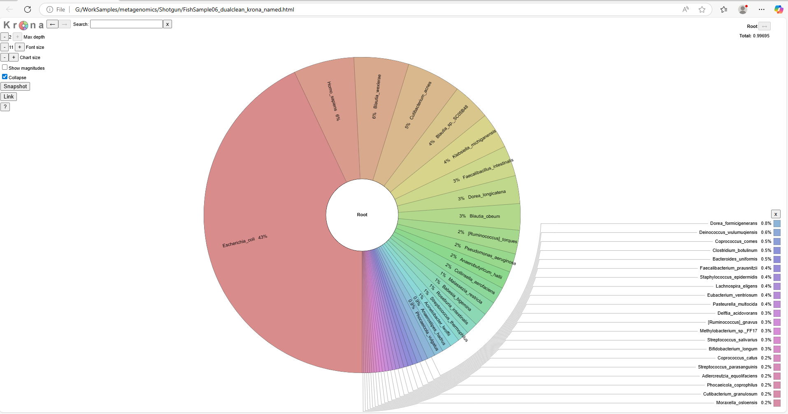

# Shotgun-GutFish-PRJNA1254096

Shotgun metagenomic profiling of fish gut microbiota using Kraken2, Bracken, and R.

---

## 📘 Project Overview

This project presents a complete workflow for shotgun metagenomic analysis of fish gut microbiota based on a sample (SRR33249106) from [BioProject PRJNA1254096](https://www.ncbi.nlm.nih.gov/bioproject/PRJNA1254096). The sample corresponds to *Schizothorax biddulphi*, a native fish species from the Kizil River (Xinjiang), and was analyzed using:

- Host decontamination with Kneaddata  
- Taxonomic classification with **Kraken2** and **Bracken**  
- Functional profiling using **eggNOG-mapper**  
- Visualization with **R**, **Krona**, and custom plots  

---

## 🧪 Workflow Summary

### 1. Data Preparation
- Downloaded raw reads using `prefetch` and `fastq-dump`
- Performed quality control using **FastQC**
- Removed host reads using **Kneaddata** with dual references (fish + human)

### 2. Taxonomic Profiling
- **MetaPhlAn 4** was attempted but yielded no usable matches.
- Used **Kraken2** and **Bracken** for robust classification.
- Visualized taxonomic data using **Krona** and barplots.

### 3. Functional Profiling
- Protein-coding genes annotated using **eggNOG-mapper**
- Top functional categories extracted and visualized.

---

## 📁 Repository Structure

Shotgun-GutFish-PRJNA1254096/
├── data/ # Bracken output, raw tables
├── results/ # Final plots, PDF summaries, Krona HTML
├── figures/ # Screenshots of visualizations
├── scripts/ # Python & shell scripts used in the workflow
└── README.md # Project documentation

---

## 📊 Results Preview

### 🧬 Krona Plot (Taxonomic Tree)

### 📈 Top 10 Species

### 🧠 Top KEGG Pathways

---

## 🔧 Tools Used

| Step | Tool |
|------|------|
| Read QC | FastQC |
| Host decontamination | Kneaddata |
| Taxonomic classification | Kraken2 + Bracken |
| Visualization | R, KronaTools |
| Functional annotation | eggNOG-mapper |

---

## 📜 Citation & Reference

If you use this workflow or parts of it, please cite the original study:

> Shotgun metagenomics analysis of gut microbiota of three indigenous fish species from the Kizil River, Xinjiang (PRJNA1254096)

---

## 🙋 Contact

Project by [Somayeh Sarirchi](https://github.com/somayehsarirchi)  
Feel free to open an issue or reach out for collaboration.

---

## 📌 Notes

- This project is a sample template for microbial profiling using public metagenomic data.
- Some steps (e.g., DeepARG, functional network mapping) can be added in follow-up phases.

